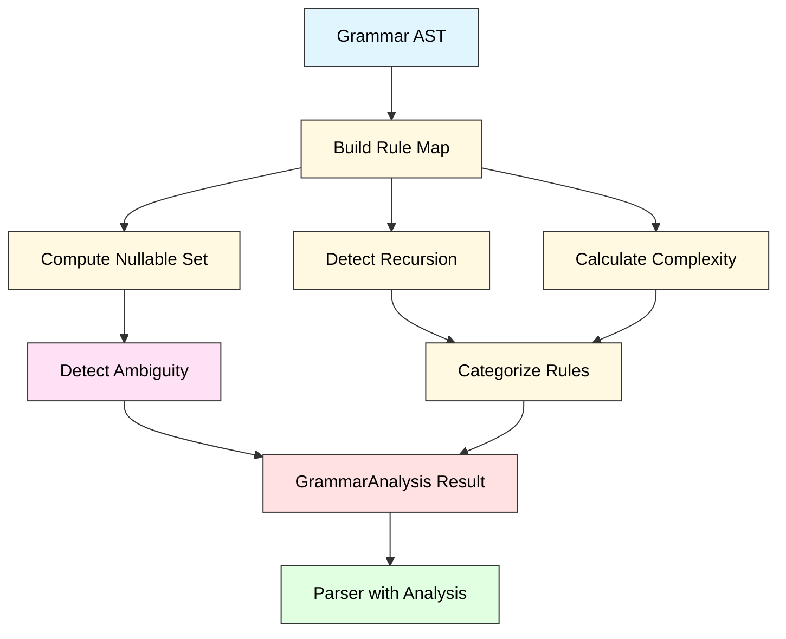
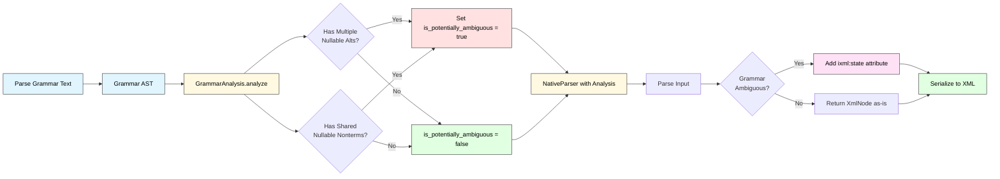
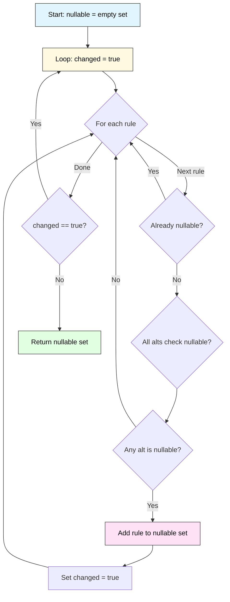

# rustixml Architecture

This document describes the architecture of rustixml v0.2.0, focusing on the **native recursive descent parser** implementation.

> **Historical Note**: rustixml originally used an Earley parser via the `earlgrey` crate (v0.1.0), but switched to a direct native implementation in v0.2.0 for better iXML semantic compatibility. See [`docs/CLAUDE_HISTORICAL.md`](docs/CLAUDE_HISTORICAL.md) for the complete development history.

## Table of Contents

1. [Overview](#overview)
2. [Core Components](#core-components)
3. [Grammar Analysis & Optimization](#grammar-analysis--optimization)
4. [Parse Flow](#parse-flow)
5. [iXML Semantic Handling](#ixml-semantic-handling)
6. [WebAssembly Support](#webassembly-support)
7. [Testing](#testing)

## Overview

### Architecture Principles

- **Direct Interpretation**: Parse iXML grammars directly without intermediate compilation
- **Zero-copy Where Possible**: Minimize string allocations during parsing
- **iXML-first Design**: Semantic operations (hiding, insertion, attributes) handled natively
- **Simple & Maintainable**: Recursive descent is easy to understand and debug

### Component Diagram

```
┌─────────────────────────────────────────────────────────────┐
│                      User Input                             │
│           (iXML Grammar String + Input Text)                │
└──────────────────┬──────────────────────────────────────────┘
                   │
                   ▼
       ┌───────────────────────────┐
       │   Grammar Parser          │
       │   (grammar_parser.rs)     │
       │                           │
       │  Lexer → Parser → AST     │
       └──────────┬────────────────┘
                  │ GrammarAst
                  ▼
       ┌───────────────────────────┐
       │   Grammar Analysis        │
       │   (grammar_analysis.rs)   │
       │                           │
       │  • Recursion detection    │
       │  • Ambiguity detection    │
       │  • Complexity scoring     │
       │  • Normalization (future) │
       └──────────┬────────────────┘
                  │ GrammarAst + Analysis
                  ▼
       ┌───────────────────────────┐
       │   Native Parser           │
       │   (native_parser.rs)      │
       │                           │
       │  • Recursive descent      │
       │  • iXML semantics         │
       │  • Mark handling          │
       │  • Ambiguity marking      │
       └──────────┬────────────────┘
                  │ XmlNode tree
                  ▼
       ┌───────────────────────────┐
       │   XML Serialization       │
       │   (xml_node.rs)           │
       │                           │
       │  XmlNode → XML String     │
       └──────────┬────────────────┘
                  │
                  ▼
       ┌───────────────────────────┐
       │      XML Output           │
       │  (with ixml:state if      │
       │   grammar is ambiguous)   │
       └───────────────────────────┘
```

## Core Components

### 1. Grammar Parser (`src/grammar_parser.rs`)

**Responsibility**: Parse iXML grammar notation into an AST.

**Key Types**:
```rust
pub struct Grammar {
    pub rules: Vec<Rule>,
}

pub struct Rule {
    pub name: String,
    pub mark: Mark,           // @, ^, - or none
    pub alternatives: Vec<Alternative>,
}

pub struct Alternative {
    pub sequence: Vec<Factor>,
}

pub enum Factor {
    Nonterminal { name: String, mark: Mark },
    Terminal(String),
    CharClass(CharClass),
    Repetition { base: Box<Factor>, op: RepOp, sep: Option<Sequence> },
    Group(Alternatives),
    Optional(Sequence),
}

pub enum Mark {
    None,        // element with children
    Hidden,      // - (omit from output)
    Attribute,   // @ (make attribute)
    Promoted,    // ^ (insert symbol)
}
```

**Parser Algorithm**: Recursive descent
- Token stream from `Lexer`
- Lookahead(1) decisions
- Builds `GrammarAst` directly

### 2. Native Parser (`src/native_parser.rs`)

**Responsibility**: Parse input text according to a grammar AST, producing XML nodes.

**Key Structures**:
```rust
pub struct NativeParser {
    grammar: Grammar,
}

pub struct ParseContext {
    recursion_depth: usize,
    max_depth: usize,
    // Rule call tracking for left-recursion detection
}

pub struct ParseResult {
    node: Option<XmlNode>,
    consumed: usize,
}
```

**Core Algorithm**: Recursive descent with backtracking

```rust
impl NativeParser {
    // Entry point
    pub fn parse(&self, input: &str) -> Result<String, String> {
        let stream = InputStream::new(input);
        let ctx = ParseContext::new();
        
        // Find start rule (first rule in grammar)
        let start_rule = &self.grammar.rules[0];
        
        // Parse starting from start rule
        let result = self.parse_rule(&stream, start_rule, &mut ctx)?;
        
        // Convert to XML string
        Ok(result.node.to_xml())
    }
    
    // Recursive descent functions
    fn parse_rule(&self, stream, rule, ctx) -> Result<ParseResult>
    fn parse_alternative(&self, stream, alt, ctx) -> Result<ParseResult>
    fn parse_factor(&self, stream, factor, ctx) -> Result<ParseResult>
    fn parse_nonterminal(&self, stream, name, ctx) -> Result<ParseResult>
    fn parse_terminal(&self, stream, literal, ctx) -> Result<ParseResult>
    fn parse_charclass(&self, stream, charclass, ctx) -> Result<ParseResult>
    fn parse_repetition(&self, stream, base, op, sep, ctx) -> Result<ParseResult>
}
```

**Backtracking**: When an alternative fails, restore input position and try next alternative.

**Performance**: O(n) for deterministic grammars, O(n²) for ambiguous (explores alternatives).

### 3. AST & XML Nodes (`src/ast.rs`)

**Responsibility**: Represent parsed results as XML tree.

```rust
pub enum XmlNode {
    Element {
        name: String,
        attributes: Vec<(String, String)>,
        children: Vec<XmlNode>,
    },
    Text(String),
    Attribute {
        name: String,
        value: String,
    },
}

impl XmlNode {
    pub fn to_xml(&self) -> String {
        // Serialize to XML string
    }
    
    pub fn text_content(&self) -> String {
        // Extract text for @ marks
    }
}
```

### 4. Character Classes (`src/charclass.rs`)

**Responsibility**: Handle iXML character class syntax `[...]`.

**Features**:
- Character ranges: `[a-z]`, `[A-Z]`, `[0-9]`
- Unicode general categories: `[L]` (letters), `[N]` (numbers), etc.
- Hex codes: `[#20-#7E]` (ASCII printable)
- Exclusions: `~[","]` (everything except comma)
- Subtraction: `[L - Lu]` (letters except uppercase)

**Implementation**:
```rust
pub struct RangeSet {
    ranges: Vec<(char, char)>,  // Sorted, non-overlapping
}

impl RangeSet {
    pub fn contains(&self, ch: char) -> bool {
        // Binary search through ranges
    }
    
    pub fn from_unicode_category(cat: &str) -> Self {
        // Use unicode-general-category crate
    }
}
```

### 5. Grammar Analysis (`src/grammar_analysis.rs`)

**Responsibility**: Analyze grammar structure to detect problematic patterns and enable optimizations.

**Key Features**:
- **Recursion Detection**: Identifies directly and indirectly recursive rules
- **Ambiguity Detection**: Detects grammars that can produce multiple parse trees
- **Complexity Scoring**: Calculates grammar complexity for performance warnings
- **Rule Categorization**: Identifies hidden, promoted, and attribute rules

**Key Structures**:
```rust
pub struct GrammarAnalysis {
    pub recursive_rules: HashSet<String>,
    pub left_recursive_rules: HashSet<String>,
    pub hidden_rules: HashSet<String>,
    pub promoted_rules: HashSet<String>,
    pub attribute_rules: HashSet<String>,
    pub complexity_scores: HashMap<String, usize>,
    pub is_potentially_ambiguous: bool,
}

impl GrammarAnalysis {
    pub fn analyze(grammar: &IxmlGrammar) -> Self {
        // Perform static analysis on grammar structure
    }

    pub fn report(&self) -> String {
        // Generate human-readable analysis report
    }
}
```

**Ambiguity Detection Patterns**:

The analyzer detects common ambiguity patterns using conservative heuristics:

1. **Multiple Nullable Alternatives**: Rules where multiple alternatives can match empty input
   ```ixml
   a: "a"* ; "b"*.  // Both alternatives match empty string
   ```

2. **Shared Nullable Nonterminals**: Alternatives starting with the same nullable rule
   ```ixml
   a: spaces, "a" ; spaces, "b".
   spaces: " "*.
   ```

**Fixpoint Nullable Detection**:

Uses iterative fixpoint algorithm to compute which rules can match empty input:

```rust
fn compute_nullable_set(rule_map: &HashMap<String, &Rule>) -> HashSet<String> {
    let mut nullable = HashSet::new();
    let mut changed = true;

    // Iterate until no more changes (fixpoint)
    while changed {
        changed = false;
        for (name, rule) in rule_map {
            if !nullable.contains(name) && is_rule_nullable(rule, &nullable) {
                nullable.insert(name.clone());
                changed = true;
            }
        }
    }

    nullable
}
```

**Integration with Parser**:

When a grammar is flagged as potentially ambiguous, the parser automatically:
1. Adds `xmlns:ixml="http://invisiblexml.org/NS"` namespace
2. Adds `ixml:state='ambiguous'` attribute to root element
3. Continues normal parsing (picks one parse tree)

### 6. WebAssembly Bindings (`src/wasm.rs`)

**Responsibility**: Export Rust functions to JavaScript/WebAssembly.

```rust
#[wasm_bindgen]
pub fn parse_ixml(grammar: &str, input: &str) -> JsValue {
    let result = match parse_ixml_grammar(grammar) {
        Ok(ast) => {
            let parser = NativeParser::new(ast);
            match parser.parse(input) {
                Ok(xml) => ParseResult::success(xml),
                Err(e) => ParseResult::error(e),
            }
        }
        Err(e) => ParseResult::error(e),
    };
    
    serde_wasm_bindgen::to_value(&result).unwrap()
}

#[wasm_bindgen]
pub struct IxmlParser {
    parser: NativeParser,
}

#[wasm_bindgen]
impl IxmlParser {
    #[wasm_bindgen(constructor)]
    pub fn new(grammar: &str) -> Result<IxmlParser, JsValue> {
        // Create reusable parser
    }
    
    pub fn parse(&self, input: &str) -> JsValue {
        // Parse with pre-compiled grammar
    }
}
```

## Grammar Analysis & Optimization

This section describes the static analysis performed on grammars before parsing begins.

### Analysis Pipeline



### Ambiguity Detection Flow

When the parser is created with a grammar, analysis happens automatically:



### Nullable Fixpoint Algorithm

The nullable detection uses a fixpoint iteration algorithm:



**Alternative Nullable Check**:
- All factors in sequence must be nullable
- Factor is nullable if:
  - It's a nonterminal in the nullable set
  - It's a repetition with `*` or `**` operator (zero or more)
  - It's an optional `?` group
  - It's a group where at least one alternative is nullable

### Static vs Runtime Analysis

rustixml uses **static analysis** to detect ambiguity:

| Approach | When | What | Pros | Cons |
|----------|------|------|------|------|
| **Static** (rustixml) | Before parsing | Analyze grammar structure | Fast, predictable | Conservative (may miss some, may have false positives) |
| **Runtime** | During parsing | Track all parse trees | Precise, complete | Slow, memory-intensive |

**Design Decision**: Static analysis enables:
- O(1) ambiguity check at parse time
- Deterministic parser behavior (always picks one tree)
- Clear user warnings about grammar issues
- Foundation for future optimizations (memoization, transformation)

### Normalization (Future)

Grammar normalization will transform grammars for better performance:

**Planned transformations**:
1. **Left-recursion elimination**: `expr: expr, "+", term` → right-recursive form
2. **Nullable factoring**: Extract common nullable prefixes
3. **Hidden rule inlining**: Inline `-` marked rules to reduce tree depth
4. **Character class partitioning**: Split overlapping ranges for faster matching

**Status**: Framework exists in `src/normalize.rs` but currently disabled. See `docs/NORMALIZATION_LESSONS.md` for details.

## Parse Flow

### Step-by-Step Example

**Grammar**:
```ixml
greeting: "Hello, ", name, "!".
name: letter+.
letter: ["A"-"Z"; "a"-"z"].
```

**Input**: `"Hello, World!"`

**Parse Steps**:

1. **Start**: Call `parse_rule` on `greeting` rule
   
2. **Parse Alternative**: `"Hello, ", name, "!"`
   - **Parse Terminal** `"Hello, "`: Match succeeds, consume 7 chars
   - **Parse Nonterminal** `name`:
     - Call `parse_rule` on `name` rule
     - **Parse Factor** `letter+`: Repetition (one or more)
       - **Parse CharClass** `["A"-"Z"; "a"-"z"]`: Match 'W', consume 1
       - Repeat for 'o', 'r', 'l', 'd' → 5 chars total
     - Return `<name>World</name>` node, consumed 5
   - **Parse Terminal** `"!"`: Match succeeds, consume 1 char
   
3. **Build Result**:
   - Combine: Text("Hello, ") + Element(name, "World") + Text("!")
   - Wrap in `<greeting>` element
   - Return `<greeting>Hello, <name>World</name>!</greeting>`

**Total consumed**: 13 characters (entire input)

### Backtracking Example

**Grammar**:
```ixml
number: hex | decimal.
hex: "0x", digit+.
decimal: digit+.
digit: ["0"-"9"].
```

**Input**: `"123"`

**Parse Steps**:

1. Try first alternative (`hex`):
   - Try to match `"0x"` → **Fails** at position 0
   - **Backtrack**: Restore position to 0
   
2. Try second alternative (`decimal`):
   - Match `digit+` → Succeeds, consume all 3 chars
   - Return `<decimal>123</decimal>`

## iXML Semantic Handling

### Marks (Operators)

iXML has 4 mark types that control XML generation:

| Mark | Symbol | Meaning | Example |
|------|--------|---------|---------|
| **None** | (default) | Wrap in element | `name: letter+.` → `<name>abc</name>` |
| **Hidden** | `-` | Omit from output | `-ws: " "+.` → (invisible) |
| **Attribute** | `@` | Make attribute | `@id: digit+.` → `id="123"` |
| **Promoted** | `^` | Insert symbol | `^comma: ",".` → `<comma/>` |

### Implementation

**Rule-level Marks** (applied to entire rule):
```rust
fn apply_rule_mark(&self, result: ParseResult, rule: &Rule) -> ParseResult {
    match rule.mark {
        Mark::None => {
            // Wrap in element with rule name
            Element { name: rule.name, children: result.children }
        }
        Mark::Hidden => {
            // Pass through children without wrapping
            result.children
        }
        Mark::Attribute => {
            // Should not happen at rule level (grammar error)
            error!("Rule-level @ not allowed")
        }
        Mark::Promoted => {
            // Force wrapping even if factor says otherwise
            Element { name: rule.name, children: result.children }
        }
    }
}
```

**Factor-level Marks** (applied to individual factors):
```rust
fn apply_factor_mark(&self, result: ParseResult, factor: &Factor) -> ParseResult {
    match factor.mark {
        Mark::Hidden => {
            // Unwrap element, pass through children
            result.children
        }
        Mark::Attribute => {
            // Convert to attribute node
            Attribute { name: factor.name, value: result.text_content() }
        }
        Mark::Promoted => {
            // Insert empty element with name
            Element { name: factor.name, attributes: [], children: [] }
        }
        Mark::None => result,
    }
}
```

### Repetition Operators

| Operator | Syntax | Meaning | Example |
|----------|--------|---------|---------|
| **Zero or more** | `*` | Optional repetition | `digit*` |
| **One or more** | `+` | Required repetition | `letter+` |
| **Zero or more with sep** | `**` | List with separator | `number++","` |
| **One or more with sep** | `++` | Non-empty list | `item++";"` |

**Implementation** (simplified):
```rust
fn parse_repetition_plus(&mut self, base: &Factor) -> ParseResult {
    let mut children = vec![];
    let mut consumed = 0;
    
    // Must match at least once
    let first = self.parse_factor(base)?;
    children.push(first.node);
    consumed += first.consumed;
    
    // Keep matching while possible
    loop {
        let pos = self.stream.position();
        match self.parse_factor(base) {
            Ok(result) => {
                children.push(result.node);
                consumed += result.consumed;
            }
            Err(_) => {
                // No more matches, restore position and break
                self.stream.set_position(pos);
                break;
            }
        }
    }
    
    Ok(ParseResult { node: merge(children), consumed })
}
```

## WebAssembly Support

### Build Process

1. **Compile to WASM**:
   ```bash
   wasm-pack build --target web --out-dir pkg
   ```

2. **Output Files**:
   - `pkg/rustixml.js` - JavaScript glue code
   - `pkg/rustixml_bg.wasm` - WebAssembly binary (156KB, 50KB gzipped)
   - `pkg/rustixml.d.ts` - TypeScript definitions

### Browser Usage

```html
<script type="module">
import init, { parse_ixml, IxmlParser } from './pkg/rustixml.js';

await init();

// One-shot parsing
const result = parse_ixml(grammar, input);

// Reusable parser
const parser = new IxmlParser(grammar);
const result1 = parser.parse(input1);
const result2 = parser.parse(input2);
</script>
```

### WASMZ Pattern

rustixml implements the **WASMZ pattern** (WebAssembly + htmz + wasm:// routing):

- **Template-Returning Functions**: WASM functions return HTML strings, not JSON
- **No Backend Required**: All processing in browser, no server roundtrips
- **~10x Performance**: Native WASM speed vs JavaScript

See [`www/wasmz.html`](www/wasmz.html) and [`www/WASMZ-PATTERN.md`](www/WASMZ-PATTERN.md) for details.

## Testing

### Test Suite Structure

```
tests/
  └── integration_test.rs    - Integration tests

ixml_tests/
  ├── correct/               - Correctness tests (49 tests, 83.7% pass)
  ├── ambiguous/             - Ambiguity detection (13 tests, 15.4% pass)
  ├── error/                 - Error handling (3 tests, 66.7% pass)
  └── ...                    - Other categories

src/bin/
  └── native_conformance_runner.rs  - Test runner
```

### Running Tests

```bash
# Unit tests
cargo test

# Integration tests
cargo test --test integration_test

# Conformance tests
cargo run --bin conformance_test

# Specific test category
cargo run --bin conformance_test -- correct/
```

### Test Results (v0.2.0)

- **Overall**: 49/65 tests passing (75.4%)
- **Correctness**: Strong coverage of core functionality ✅
- **Ambiguous**: Static detection implemented, some tests require runtime tracking
- **Error**: Good error handling coverage

**Notable Features**:
- Grammar analysis enabled with recursion and ambiguity detection
- Fixpoint nullable detection handles complex mutual recursion
- Static ambiguity detection adds `ixml:state='ambiguous'` automatically
- No regressions from analysis integration

See [`KNOWN_ISSUES.md`](KNOWN_ISSUES.md) for details on failing tests.

## Performance Characteristics

### Time Complexity

- **Deterministic grammars**: O(n) where n = input length
- **Ambiguous grammars**: O(n²) or worse (explores all alternatives)
- **Pathological cases**: O(n³) with deep backtracking

### Space Complexity

- **Parse tree**: O(n) for tree nodes
- **Call stack**: O(d) where d = grammar depth
- **No memoization**: No caching of parse results (could add in v0.3)

### Typical Performance

- Simple grammars: < 1ms for small inputs
- Medium grammars: 1-10ms for typical inputs
- Complex grammars: 10-100ms (still acceptable)

## Future Improvements

See [`docs/STRATEGY_OPTIONS.md`](docs/STRATEGY_OPTIONS.md) for detailed analysis.

**Completed** (v0.2.0):
- ✅ Grammar analysis framework
- ✅ Recursion detection (direct and indirect)
- ✅ Static ambiguity detection with automatic marking
- ✅ Fixpoint nullable detection
- ✅ Complexity scoring

**Short term** (v0.3):
- Enable character class partitioning
- Add basic memoization (packrat parsing)
- Improve ambiguity detection patterns (reduce false negatives)
- Re-enable left-recursion detection (nullable check needs iterative rewrite)

**Medium term** (v0.4):
- Left-recursion transformation
- Enable grammar normalization (currently disabled)
- Nonterminal inlining for hidden rules
- Runtime ambiguity tracking (for 100% conformance)

**Long term** (v1.0):
- Consider LALR+GLR for 100% conformance
- Advanced optimizations using analysis
- Full iXML 1.0 spec support

## References

- [iXML Specification](https://invisiblexml.org/1.0/)
- [KNOWN_ISSUES.md](KNOWN_ISSUES.md) - Current limitations
- [STRATEGY_OPTIONS.md](docs/STRATEGY_OPTIONS.md) - Improvement strategies
- [CLAUDE_HISTORICAL.md](docs/CLAUDE_HISTORICAL.md) - Complete development history
- [GRAMMAR_ANALYSIS_STATUS.md](docs/GRAMMAR_ANALYSIS_STATUS.md) - Grammar analysis implementation details
- [NORMALIZATION_LESSONS.md](docs/NORMALIZATION_LESSONS.md) - Lessons learned from normalization attempts

---

*For detailed implementation notes and historical context, see the docs/ directory.*
