# rustixml Architecture Documentation

This document describes the complete processing pipeline for rustixml, an iXML (Invisible XML) parser implementation in Rust.

## Table of Contents

1. [High-Level Overview](#high-level-overview)
2. [Grammar Parsing Pipeline](#grammar-parsing-pipeline)
3. [Runtime Parsing Pipeline](#runtime-parsing-pipeline)
4. [XML Generation Pipeline](#xml-generation-pipeline)
5. [Semantic Actions System](#semantic-actions-system)
6. [Mark Processing](#mark-processing)
7. [Test Infrastructure](#test-infrastructure)

---

## High-Level Overview

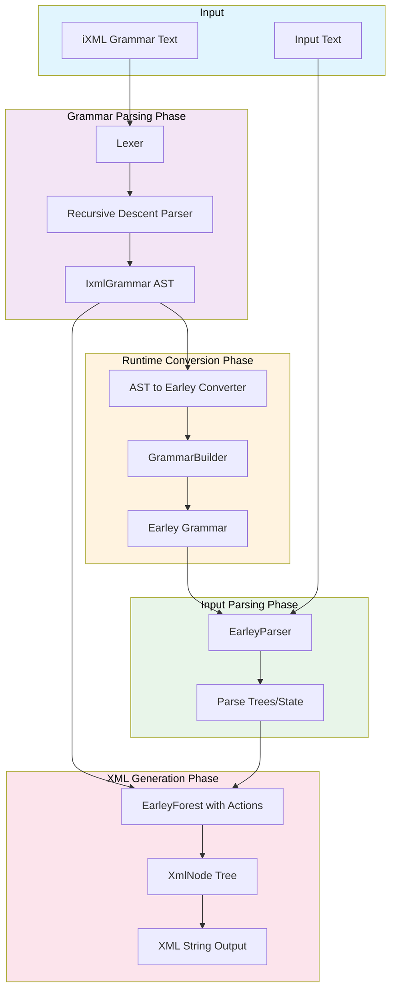

**Test References:**
- All 49 tests in `/home/bigale/repos/ixml/tests/correct/` exercise this complete pipeline
- `arith`, `hash`, `test` - Simple grammars that test basic pipeline flow

---

## Grammar Parsing Pipeline

### Lexer Stage

The lexer (`src/lexer.rs`) tokenizes iXML grammar text into a stream of tokens.

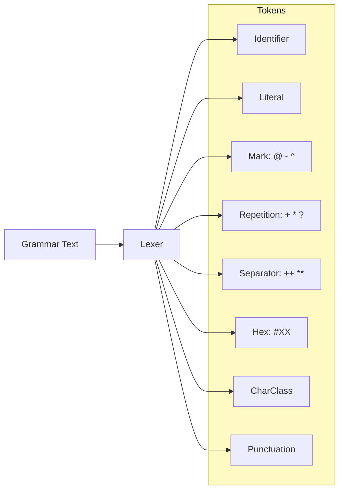

**Key Features:**
- Handles brace comments `{...}` including nested comments
- Supports hex characters `#a`, `#20`, etc.
- Recognizes double operators `++` and `**` for separated repetitions

**Test References:**
- `nested-comment` - Tests nested brace comment handling
- `hex`, `hex1`, `hex3` - Tests hex character lexing
- `lf`, `tab` - Tests special character handling

### Parser Stage

The handwritten recursive descent parser (`src/grammar_parser.rs`) builds the AST.

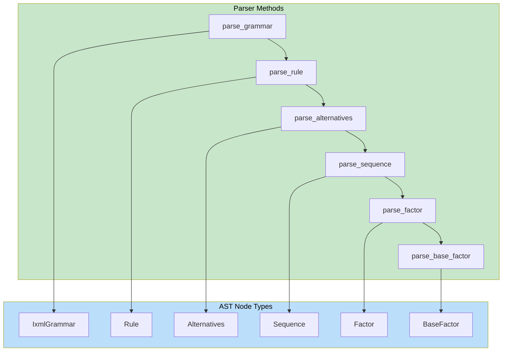

**BaseFactor Variants:**

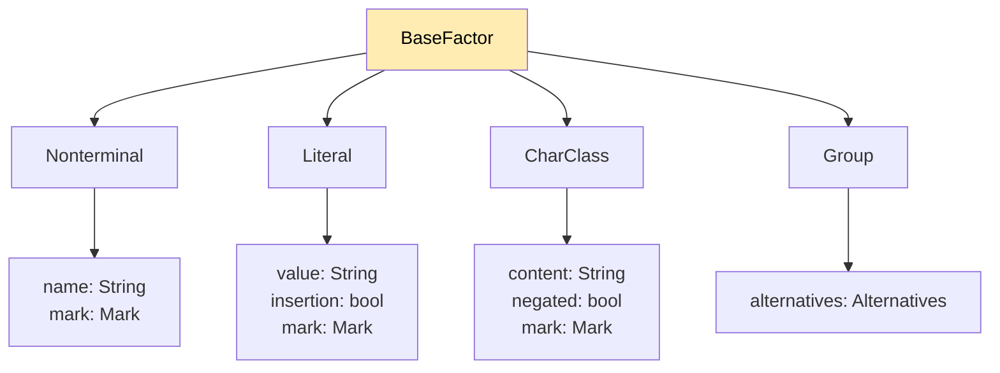

**Test References:**
- `marked` - Tests mark parsing (`@`, `-`, `^`)
- `string` - Tests literal parsing
- `range`, `ranges` - Tests character class parsing
- `empty-group` - Tests group parsing

---

## Runtime Parsing Pipeline

### AST to Earley Conversion

The converter (`src/runtime_parser.rs:ast_to_earlgrey`) transforms the iXML AST into an Earley grammar.

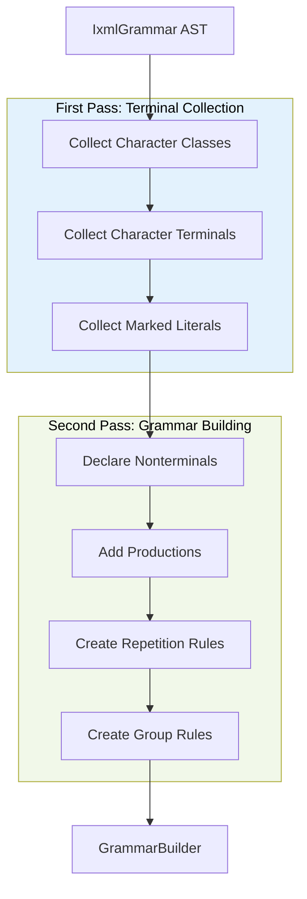

### Repetition Handling

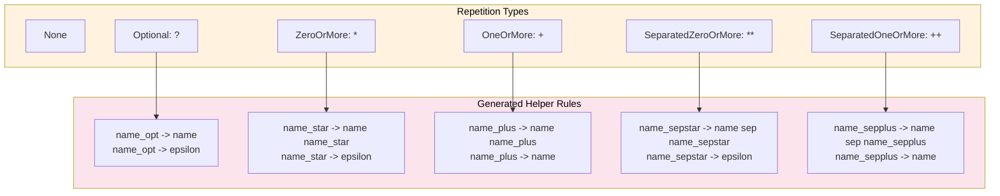

**Test References:**
- `hash` - Tests separated repetitions (`++`)
- `expr1` through `expr6` - Tests complex repetition patterns
- `para-test` - Tests `+` repetition

---

## XML Generation Pipeline

### EarleyForest Actions

The forest (`src/runtime_parser.rs:build_xml_forest`) registers semantic actions for each production.

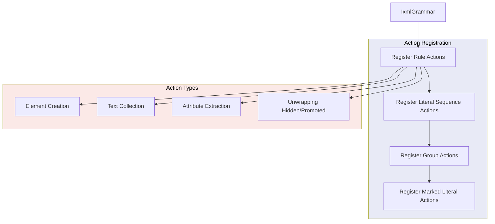

### XmlNode Structure

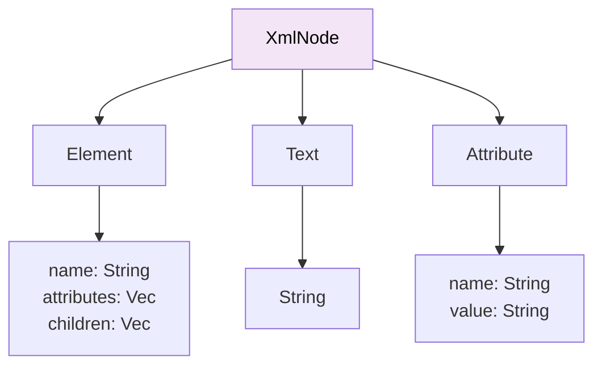

### XML Serialization

The serializer (`src/runtime_parser.rs:to_xml`) produces canonical iXML format.

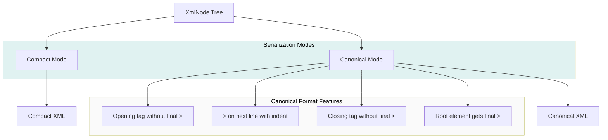

**Test References:**
- `arith` - Tests canonical format with nested elements
- `attribute-value` - Tests attribute escaping
- `element-content` - Tests text content escaping

---

## Semantic Actions System

### Node Processing Flow

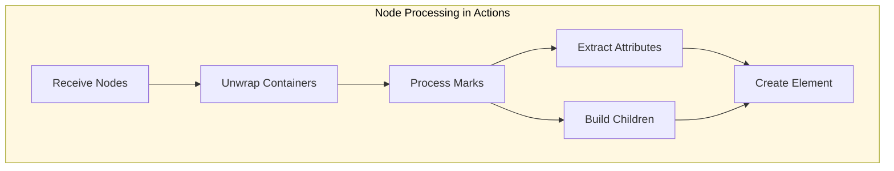

### Container Unwrapping

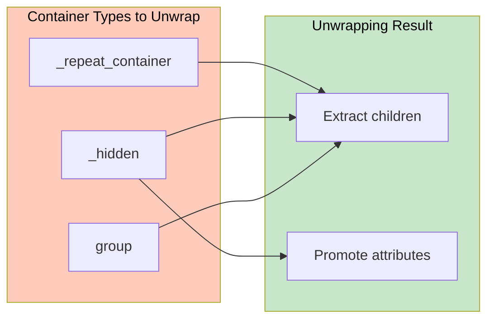

---

## Mark Processing

### Mark Types and Effects

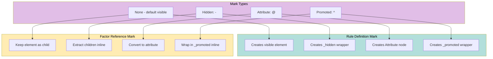

**Test References:**
- `aaa` - Tests hidden marked literals (`-"text"`)
- `marked` - Tests attribute marks (`@name`)
- `lf` - Tests hidden hex chars (`-#a`)

### Mark Override Behavior

When a factor mark differs from the rule definition mark:

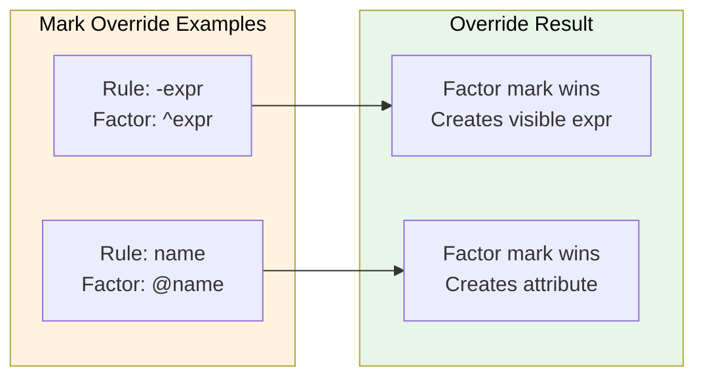

**Test References:**
- `expr2` - Tests `^expr` promoting hidden `-expr`
- `expr1` - Tests `@plusop` creating attributes from factor

---

## Test Infrastructure

### Test Runner Architecture

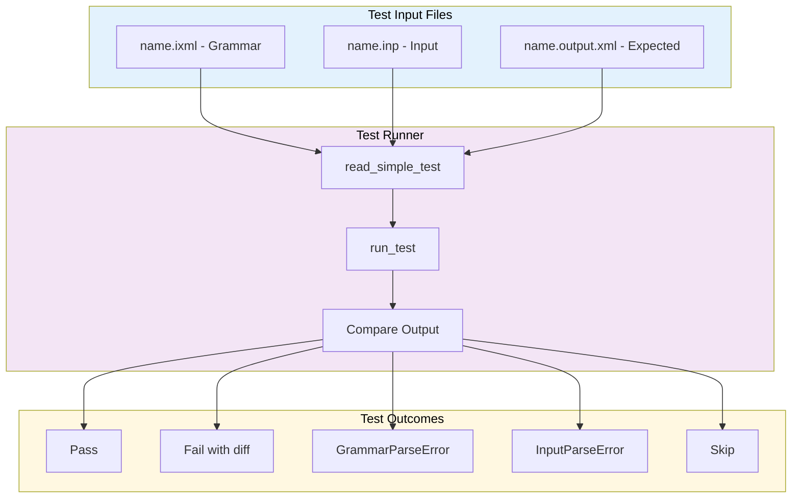

### Docker Test Environment

```mermaid
flowchart TB
    subgraph DockerEnv[Docker Environment]
        DF[Dockerfile.test]
        IMG[rustixml-test image]
        CNT[Container]
    end

    subgraph SafeRunner[Safe Conformance Runner]
        PC[Panic Catching]
        TO[2s Timeout]
        IW[Incremental Write]
        SK[Skip Known Crashers]
    end

    subgraph Output[Test Output]
        SO[stdout progress]
        RF[/tmp/safe_results.txt]
        SUM[Summary stats]
    end

    DF --> IMG
    IMG --> CNT
    CNT --> PC
    CNT --> TO
    CNT --> IW
    CNT --> SK
    PC --> SO
    IW --> RF
    RF --> SUM

    style DockerEnv fill:#ffecb3,color:#000
    style SafeRunner fill:#c8e6c9,color:#000
    style Output fill:#e1bee7,color:#000
```

### Test Categories and Status

| Category | Count | Status | Examples |
|----------|-------|--------|----------|
| Passing | 30 | Complete | `arith`, `hash`, `test`, `hex`, `marked` |
| Failing | 8 | Output mismatch | `json`, `vcard`, `xml`, `expr1`, `expr2`, `expr4` |
| Error | 6 | Parse issues | `email`, `unicode-classes`, `xpath` |
| Timeout | 0 | Fixed | Previously `expr1-6`, `diary1-3` |

### Semantic XML Comparison

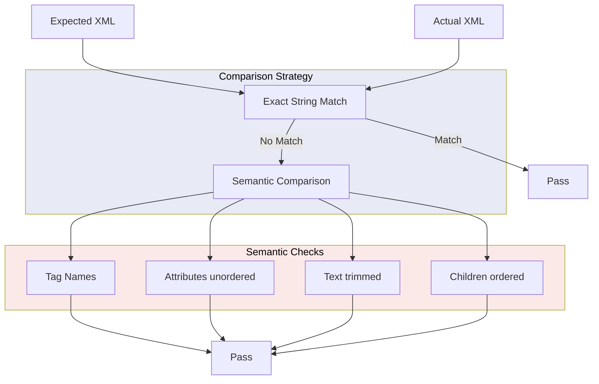

---

## File Reference

| File | Purpose | Key Functions |
|------|---------|---------------|
| `src/lexer.rs` | Tokenization | `Lexer::next_token()` |
| `src/ast.rs` | AST definitions | `IxmlGrammar`, `Rule`, `Factor` |
| `src/grammar_parser.rs` | Recursive descent parser | `parse_ixml_grammar()` |
| `src/grammar_ast.rs` | Parser entry point | Re-exports parser |
| `src/runtime_parser.rs` | Earley conversion + XML | `ast_to_earlgrey()`, `build_xml_forest()` |
| `src/testsuite_utils.rs` | Test infrastructure | `run_test()`, `xml_deep_equal()` |
| `src/bin/safe_conformance_runner.rs` | Docker test runner | Panic-safe test execution |

---

## Known Issues and Recent Fixes

### Recent Fixes (November 2025)

1. **GROUP_COUNTER Synchronization** - Fixed Missing Action errors
   - **Problem:** AST traversed twice (conversion + action registration), counter incremented differently
   - **Solution:** Thread-local `GROUP_ID_MAP` stores `group_pointer → group_id` mapping
   - **Result:** Eliminated all "Missing Action" errors, 1 test moved from INPUT_ERROR to FAIL

2. **Character Class Parsing** - Fixed unquoted character sequences
   - **Problem:** `[xyz]` treated "xyz" as Unicode category, not individual chars
   - **Solution:** Added else clause in `parse_char_class()` to split unquoted sequences
   - **Result:** Character classes now work in simple cases
   - **File:** `src/runtime_parser.rs:1322`

3. **Test Classification** - Identified intentionally invalid tests
   - **Problem:** `elem1` has empty character class `[]` causing parse failure
   - **Solution:** Added skip logic for invalid grammar tests
   - **Result:** Reduced noise in test results

### Current Limitations

1. **Large Grammar Parsing** - Some tests with 40+ alternatives fail
   - Tests: `unicode-classes`, `ixml-spaces`, `ixml3`
   - Status: Parse succeeds for simple versions, fails for full grammar
   - Hypothesis: Earley parser limitations with large choice sets

2. **Promoted mark handling** - `^` on hidden elements needs proper element name restoration
   - Affects: `expr2`, `expr4` tests
   - Status: Output structure incorrect

3. **Separated repetition attributes** - `@plusop` in `term++plusop` not collected to parent
   - Affects: `expr1` test
   - Status: Attributes not propagated correctly

### Architectural Considerations

**Translation Layer Complexity:**
The current implementation translates iXML to Earley grammar, which creates several challenges:

1. **Impedance Mismatch** - Earley expects token-level parsing, we do character-level
2. **Helper Nonterminals** - Repetitions require generated rules (`name_plus`, `name_star`)
3. **Synchronization Issues** - Multiple AST traversals need coordinated state (GROUP_COUNTER)
4. **Predicate Generation** - Character classes converted to Rust predicates

See `ABSTRACTION_ANALYSIS.md` for detailed discussion of specification-driven vs translation-based approaches.

### Performance Considerations

- Handwritten parser: O(n) linear time for grammar parsing
- Earley parser: O(n³) worst case, O(n) for unambiguous grammars
- Character-level tokenization: Every character is a separate token
- Left-recursive grammars may cause performance issues
- Large grammars (40+ rules) may hit Earley limitations

### Test Coverage Status (November 2025)

**Current Results:**
- **53 PASS** (39.8%) - Core functionality working
- **12 FAIL** (9.0%) - Output mismatch, need XML structure fixes
- **3 INPUT_ERROR** (2.3%) - Parse failures on large grammars
- **65 SKIP** (48.9%) - No expected output or test configuration

**Priority Issues:**
1. Fix large grammar parsing (unicode-classes, ixml-spaces, ixml3)
2. Fix promoted mark handling (expr2, expr4)
3. Fix attribute collection in separated repetitions (expr1)

**Target:** 90%+ pass rate
- Secondary: Resolve input parse errors
